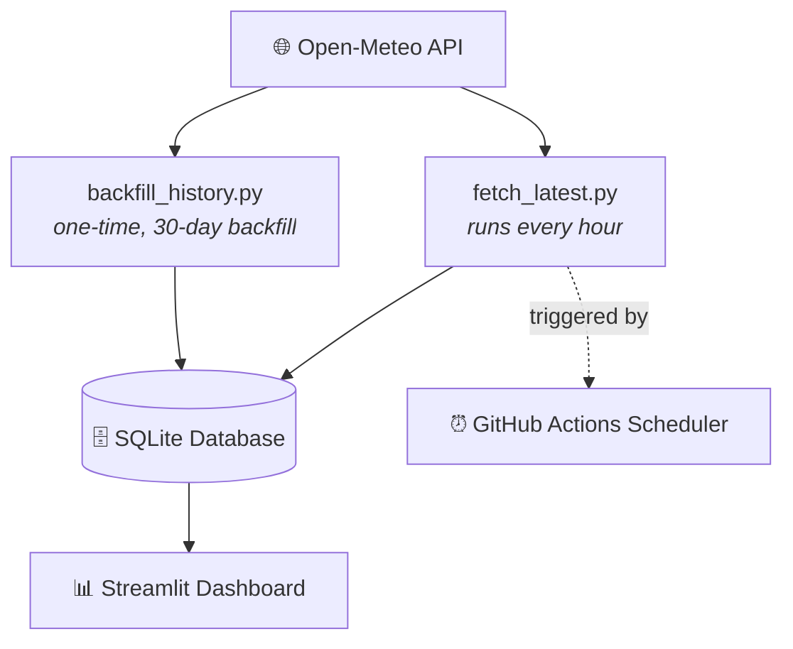

# 🌫️ India Air Quality & Weather Tracker

<div align="center">


**A fully automated data pipeline that tracks live air quality & weather across 8 Indian cities — updated every hour, zero manual work.**

[🔴 Live Dashboard](https://india-aqi-weather-tracker.streamlit.app/) · [🐛 Report Bug](https://github.com/mrshivam77/india-aqi-weather-tracker/issues) · [✨ Request Feature](https://github.com/mrshivam77/india-aqi-weather-tracker/issues)

</div>

---

## 📑 Table of Contents

- [🎯 Problem](#-problem)
- [✨ Features](#-features)
- [🏗️ Architecture](#️-project-architecture)
- [⚙️ How It Works](#️-how-the-pipeline-works)
- [🔍 Cities Tracked](#-cities-tracked)
- [🛠️ Tech Stack](#️-tech-stack)
- [📁 Project Structure](#-project-structure)
- [🚀 Getting Started](#-getting-started)
- [📌 Why This Project Stands Out](#-why-this-project-stands-out)
- [🚀 Future Improvements](#-future-improvements)

---

## 🎯 Problem

Most air quality dashboards either display only the latest readings or rely on static datasets. This project builds an automated data pipeline that continuously collects live air quality and weather data for major Indian cities, stores historical records in a SQLite database, and powers an interactive dashboard with zero manual intervention.

---

## ✨ Features

| | |
|---|---|
| 🌍 **Live Monitoring** | Real-time AQI & weather for 8 Indian cities |
| 🔄 **Auto-Updates** | Hourly refresh via GitHub Actions — no server needed |
| 🗄️ **Historical Storage** | Every reading persisted to SQLite |
| 📊 **Interactive Dashboard** | Built with Streamlit + Plotly |
| 📈 **Trend Analysis** | PM2.5, temperature, and AQI trends over time |
| ⚡ **Fully Automated** | End-to-end pipeline, zero manual intervention |
| 🔑 **No API Key Needed** | Powered by the free Open-Meteo API |

---

## 📊 Live Demo

<div align="center">

### 👉 [**View the interactive dashboard →**](https://india-aqi-weather-tracker.streamlit.app/)

</div>

---

## 🏗️ Project Architecture



<details>
<summary><b>Prefer the plain-text version? Click to expand</b></summary>

```text
                Open-Meteo API
                      │
                      ▼
        backfill_history.py (One-Time)
                      │
                      ▼
             SQLite Database
                      ▲
                      │
     fetch_latest.py (Every Hour)
                      │
          GitHub Actions Scheduler
                      │
                      ▼
        Streamlit Interactive Dashboard
```

</details>

---

## ⚙️ How the Pipeline Works

### 1️⃣ Backfill Historical Data
**`scripts/backfill_history.py`**
- Runs only once, locally.
- Downloads 30 days of hourly historical AQI and weather data for all cities.
- Stores everything inside a SQLite database.

### 2️⃣ Automatic Hourly Updates
**`scripts/fetch_latest.py`**
- Fetches the latest AQI and weather readings.
- Appends new records to the SQLite database.
- Runs automatically every hour via GitHub Actions.
- Commits the updated database back to GitHub.
- No server or personal computer needs to stay running.

### 3️⃣ Interactive Dashboard
**`dashboard/app.py`** reads directly from the SQLite database and provides:
- ✅ Current AQI and weather snapshots
- ✅ Historical AQI trends
- ✅ PM2.5 trend analysis
- ✅ Average AQI comparison across cities
- ✅ Temperature vs PM2.5 relationship
- ✅ Interactive Plotly visualizations

---

## 🔍 Cities Tracked

<div align="center">

`Bangalore` `Mumbai` `New Delhi` `Gorakhpur` `Chennai` `Hyderabad` `Pune` `Kolkata`

</div>

---

## 🛠️ Tech Stack

| Layer | Technology |
|---|---|
| **Language** | Python |
| **Data Handling** | Pandas, Requests |
| **Storage** | SQLite |
| **Dashboard** | Streamlit, Plotly |
| **Automation** | GitHub Actions |
| **Data Source** | Open-Meteo API |

---

## 📁 Project Structure

<details>
<summary><b>Click to expand full folder tree</b></summary>

```text
├── .github/
│   └── workflows/
│       └── update_data.yml
├── dashboard/
│   └── app.py
├── data/
│   └── air_quality.db
├── notebooks/
│   └── 01_explore.ipynb
├── scripts/
│   ├── backfill_history.py
│   ├── fetch_latest.py
│   ├── db.py
│   └── cities.py
├── requirements.txt
└── README.md
```

</details>

---

## 🚀 Getting Started

<details>
<summary><b>1. Clone the Repository</b></summary>

```bash
git clone https://github.com/mrshivam77/india-aqi-weather-tracker.git
cd india-aqi-weather-tracker
```
</details>

<details>
<summary><b>2. Install Dependencies</b></summary>

```bash
pip install -r requirements.txt
```
</details>

<details>
<summary><b>3. Backfill Historical Data</b> <i>(run once)</i></summary>

```bash
python scripts/backfill_history.py
```

This creates `data/air_quality.db` with 30 days of historical AQI and weather data.
</details>

<details>
<summary><b>4. Launch the Dashboard</b></summary>

```bash
streamlit run dashboard/app.py
```
</details>

<details>
<summary><b>5. Enable Automatic Updates</b></summary>

After pushing the project to GitHub:
1. Open the **Actions** tab.
2. Enable the **Update Air Quality Data** workflow.
3. GitHub Actions will run it automatically every hour.
4. You can also click **Run workflow** to trigger it manually.
</details>

<details>
<summary><b>6. Deploy to Streamlit Community Cloud</b></summary>

Deploy the app using `dashboard/app.py` as the entry point.

Since the SQLite database is updated every hour through GitHub Actions, the dashboard always shows the latest available data automatically.
</details>

---

## 📌 Why This Project Stands Out

> Most beginner data portfolios stop at analyzing a downloaded CSV.

This project demonstrates a **complete end-to-end data pipeline**:

- 🌐 Collects live data from real-world APIs
- ⏱️ Automates hourly data ingestion using GitHub Actions
- 🗄️ Stores historical records inside a SQLite database
- 📊 Visualizes insights through an interactive dashboard

Unlike a typical Kaggle notebook that performs a one-time analysis on a static dataset, this project simulates a **production-style analytics workflow** — automated data collection, scheduled updates, persistent storage, and live visualization.

---

## 🚀 Future Improvements

- [ ] Support for 100+ Indian cities
- [ ] PostgreSQL integration instead of SQLite
- [ ] Docker containerization
- [ ] AQI alert notifications via Email/SMS
- [ ] Machine Learning-based AQI forecasting
- [ ] REST API for external integrations

---

<div align="center">

Made with ☕ by [Shivam](https://github.com/mrshivam77)

</div>
